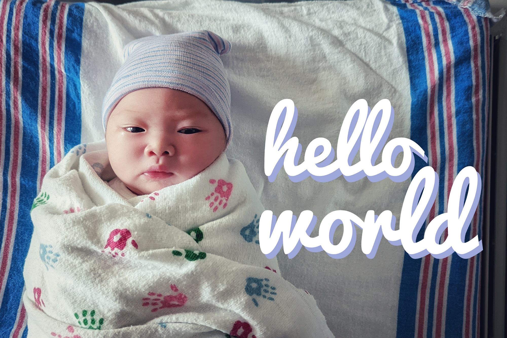

Jonathan and Wendy proudly welcome **Yasmine Chen** into their family.  
Yasmine was born on August 7th at 11:58am weighing 7 pounds 11 ounces and measuring 21¼ inches.
  
Mom, dad, and baby are happy, healthy, and doing great (and quite a bit tired).
Mantao is doing his best to be a good big brother.

## Statistics
* born on August 7 at 16:58 UTC
* 7 pounds 11 ounces/3500 grams
* 21¼ inches/53.975 centimeters
* Endured 8.5 hours of labor
* Participated in eating 6 watermelons

## Etymology
Yasmine is a variant of _[Yasmin][1]_, the Persian name for the [jasmine][2] genus of plants which are known for the distinct fragrance of its flowers.
  
[Jasmine tea][3], a combination of white or green tea and jasmine blossoms, is Wendy and Jonathan's go-to pairing with [dim sum][4].
It is also delicious as an alternative in bubble tea recipes or mixed with fruit juice (especially grapefruit or passionfruit).

Just like the English spelling[^1], Yasmine is reminescent of the strong yet sweet scent of the jasmine flower- both characteristics which she hopes to posess.

  [1]: https://en.wikipedia.org/wiki/Yasmin_(given_name)
  [2]: https://en.wikipedia.org/wiki/Jasmine
  [3]: https://en.wikipedia.org/wiki/Jasmine_tea
  [4]: https://asiasociety.org/reference/what-dim-sum-beginners-guide-south-chinas-traditional-brunch-meal
  
  [^1]: Unlike the English spelling, it does not begin with the letter 'J' which is already common in Jonathan's family.
  
## Changelog
Yes.  So many diapers.

## Versioning
This project uses [Semantic Versioning](https://semver.org/).
The following versioning scheme is used until the first major version release:
* `MINOR` version tracks month
* `PATCH` version tracks week
* `pre-release identifier` optionally tracks the day

## Upcoming Features and Milestones
TODO
<!-- See the [issue tracker](https://github.com/xe2io/babychen__its-a-girl/issues) -->

